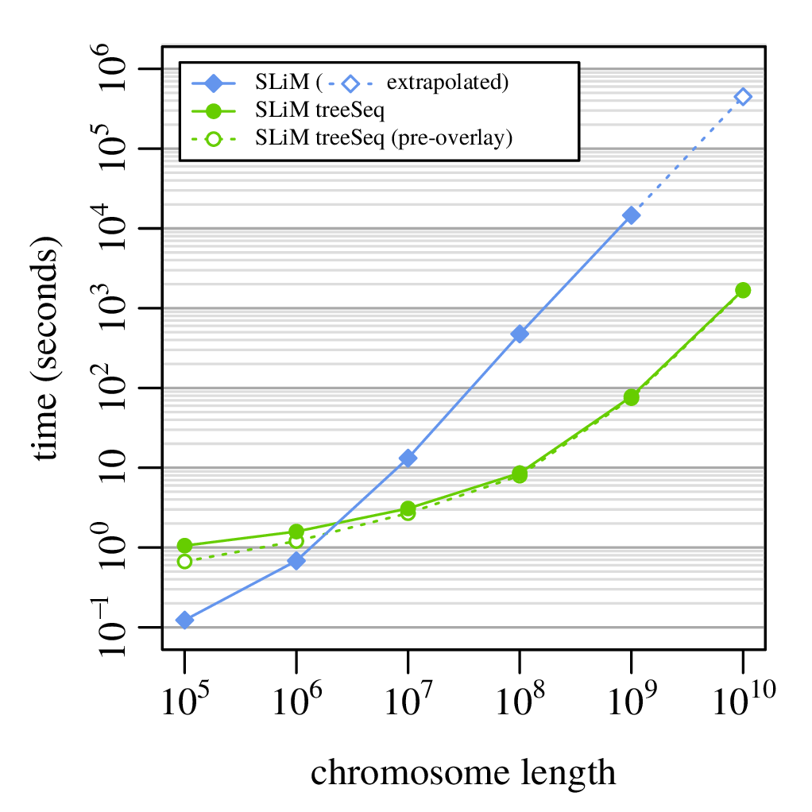
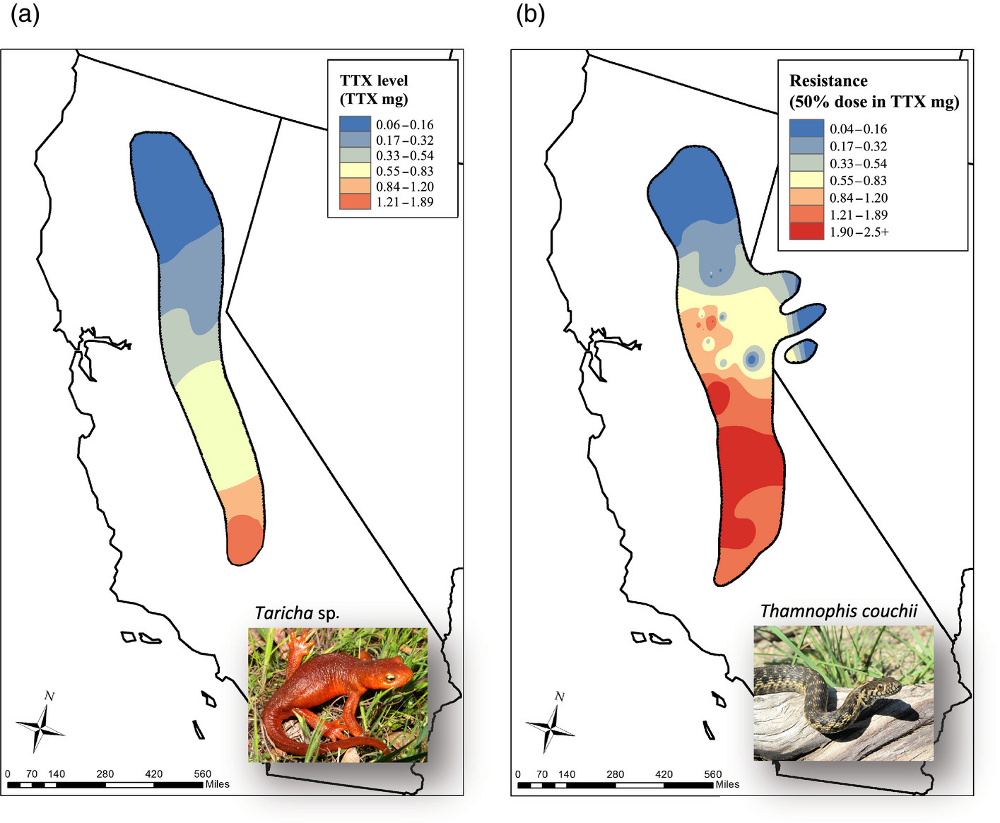
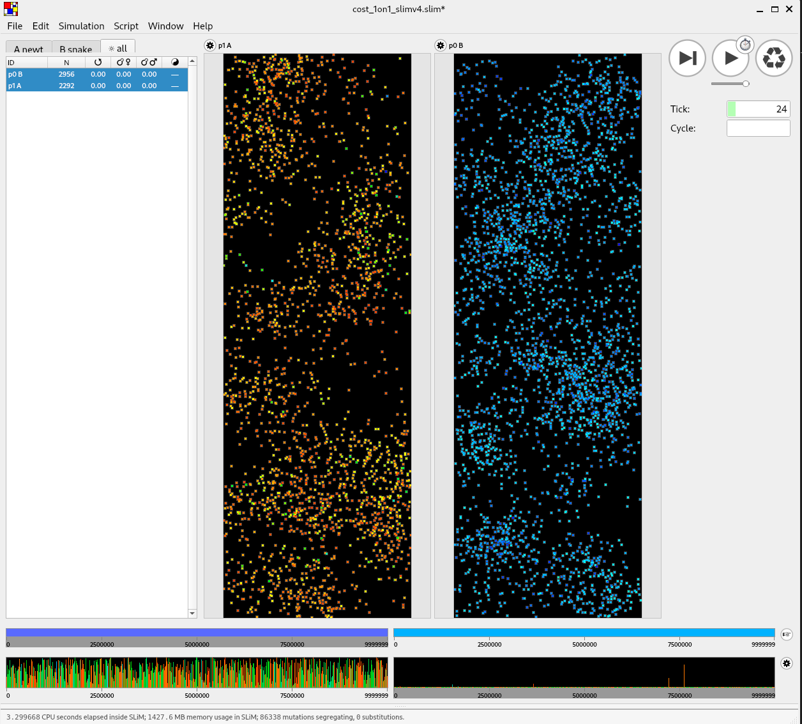
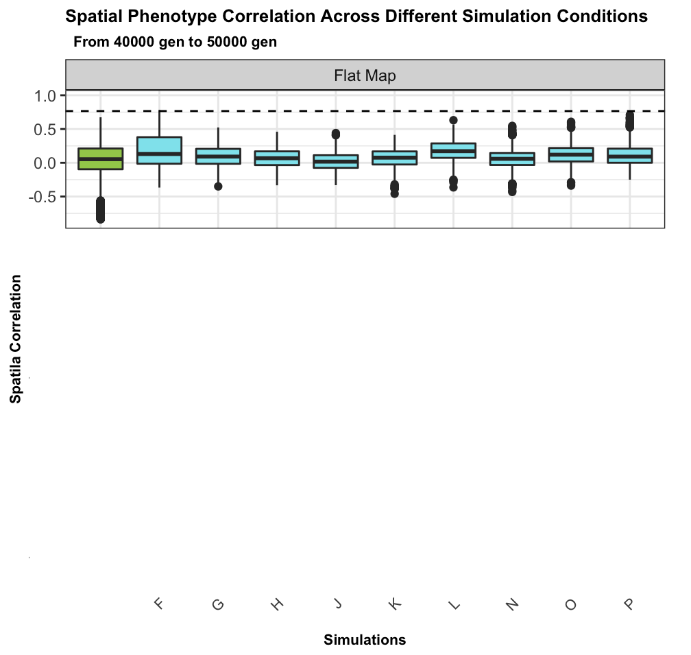
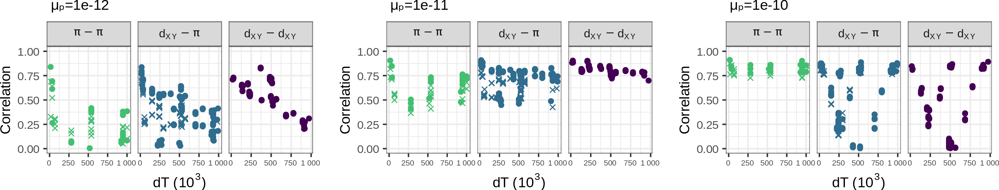
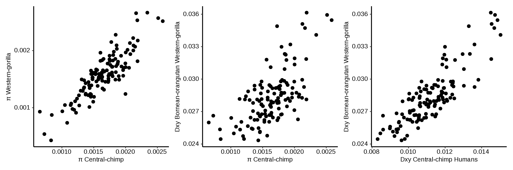
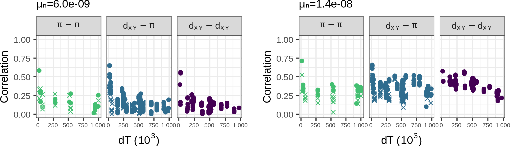
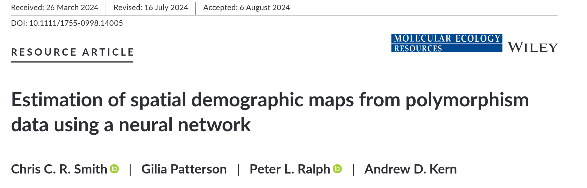
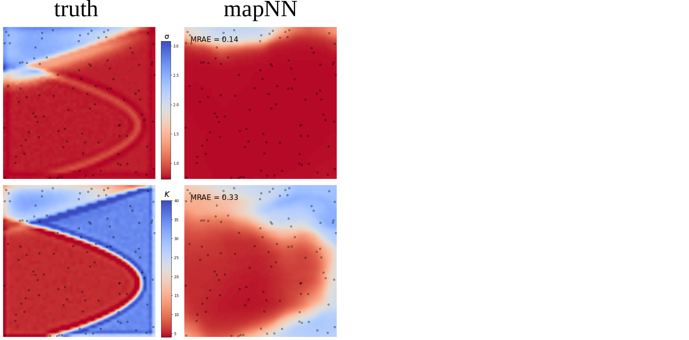

--------------------

<!--
title-slide-attributes:
    data-background-image: /path/to/title_image.png
    data-background-size: contain
-->

<!--
Abstract:
Modern datasets have made it possible to use genomic data to try to answer
increasingly detailed and practically relevant questions about evolution and
ecology. Although in many applications analytical inference methods are
infeasible or not available, simulation-based inference is possible for any
system that can be simulated. In this talk I will describe recent progress in
simulating large, evolving populations, and storing and analyzing the entire
genomic history of these simulations (using SLiM and the "tree sequence" data
structure). I will then give three examples of applications: understanding how
the balance of different types of natural selection, mutation rate variation,
and other processes produced the landscapes of genetic diversity in the great
apes; describing conditions under which coevolution can produce spatial
correlations in phenotypes such as seen in the classic Taricha newt-Thamnophis
garter snake system; and training a deep learning model to predict maps of
population density.
-->

> UO is located on the traditional indigenous homeland of the Kalapuya people.
Kalapuya people were dispossessed of their indigenous homeland by the United States government and forcibly removed.
Today, Kalapuya descendants are primarily citizens of the Confederated Tribes of Grand Ronde and the Confederated Tribes of Siletz Indians,
and continue to make important contributions to their communities, to the UO, to Oregon, and to the world.

. . .

::: centered
USC: on unceded Tongva land
:::

## Outline of the talk

1. Genomes, and simulations
2. The tree sequence (but, mostly tomorrow)
3. Applications

*slides:* [github.com/petrelharp/usc-ceed-2024](https://petrelharp.github.io/usc-ceed-2024/usc-ceed-2024.slides.html)

## Motivating problems

:::: {.columns}
:::::::: {.column width=60%}

1. What models are consistent with the observed spatial patterns
    of coevolution between *Taricha* newts and *Thamnophis* snakes?

2. How much natural selection is needed to explain the correlations in genetic diversity
    along the genomes of the great apes?

3. How can we predict the landscape of population density
    using spatial genomic data?

:::: 
:::::::: {.column width=40%}

{width=100%}

:::: 
::::::::

::: {.centered}
{width=60%}
::: 

# Inference, with genomes

##

##

##

##

##

## Simulation-based inference

::: {.centered}
{width=60%}
:::

- bespoke confirmatory simulations
- optimization of one or two parameters
    <!-- *(if between-simulation noise is small)* -->
- Approximate Bayesian Computation (ABC)
- deep learning

# What do we need

##

1. Fast simulation of genomes

2. Fast computation of summary statistics

## Wish list:

::: {.smallish}

::: {.columns}
::::::: {.column}

Whole genomes,
thousands of samples, \
from millions of individuals.

**Demography:**

- life history 
- separate sexes
- selfing
- polyploidy
- species interactions

**Geography:**

- discrete populations
- continuous landscapes
- barriers

**History:**

- ancient samples
- range shifts

:::
::::::: {.column}

**Natural selection:**

- selective sweeps
- introgressing alleles
- background selection
- quantitative traits
- incompatibilities
- local adaptation

**Genomes:**

- recombination rate variation
- gene conversion
- infinite-sites mutation
- nucleotide models
- context-dependence
- mobile elements
- inversions
- copy number variation

:::
:::::::

:::

## Enter SLiM

::: {.columns}
::::::: {.column width=50%}

by Ben Haller and Philipp Messer

an individual-based, scriptable forwards simulator

:::: {.caption}

*Ben Haller*
::::

:::
::::::: {.column width=50%}

[messerlab.org/SLiM](https://messerlab.org/SLiM/)

:::
:::::::

##

::: {.smallish}

::: {.columns}
::::::: {.column}

- <s>Whole genomes,</s>*
- <s>thousands of samples, </s>
- <s>from millions of individuals.</s>*

**Demography:**

- <s>life history</s>
- <s>separate sexes</s>*
- <s>selfing</s>
- polyploidy*
- <s>species interactions</s>

**Geography:**

- <s>discrete populations</s>
- <s>continuous landscapes</s>
- <s>barriers</s>*

**History:**

- <s>ancient samples</s>
- <s>range shifts</s>

:::
::::::: {.column}

**Natural selection:**

- <s>selective sweeps</s>
- <s>introgressing alleles</s>
- <s>background selection</s>
- <s>quantitative traits</s>*
- <s>incompatibilities</s>*
- <s>local adaptation</s>*

**Genomes:**

- <s>recombination rate variation</s>
- <s>gene conversion</s>
- <s>infinite-sites mutation</s>
- <s>nucleotide models</s>
- <s>context-dependence</s>*
- mobile elements*
- <s>inversions</s>
- copy number variation

:::
:::::::

:::

## 

- <s>Whole genomes,</s>*

<!-- Tree sequences -->

# The tree sequence

## Meiosis & Recombination

::: {.columns}
::::::: {.column width=50%}

:::
::::::: {.column width=50%}

- You have two copies of each chromosome, 
  one from each parent.

- When you make a gamete, the copies *recombine*.

- *Mutations* appear.

:::
::::::

## History is a sequence of trees

For a set of sampled chromosomes,
at each position along the genome there is a genealogical tree
that says how they are related.

. . .

----------------------

The **succinct tree sequence**

::: {.floatright}
is a way to succinctly describe this, er, sequence of trees

*and* the resulting genome sequences.

:::: {.caption}
[Kelleher, Etheridge, & McVean](http://journals.plos.org/ploscompbiol/article?id=10.1371/journal.pcbi.1004842) 
::::
:::

. . .

::: {.columns}
:::::: {.column width=50%}

{width=100%}

:::
:::::: {.column width=50%}

::: {.floatright}
{width=80%}

:::: {.caption}
jerome kelleher
::::

:::

:::
::::::

## File sizes

::: {.centered}
{width=90%}
:::

::: {.caption}
100Mb chromosomes;
from [Kelleher et al 2018, *Inferring whole-genome histories in large population datasets*](https://www.nature.com/articles/s41588-019-0483-y), Nature Genetics
:::

<!-- Estimated sizes of files required to store the genetic variation data for a
simulated human-like chromosome (100 megabases) for up to 10 billion haploid
(5 billion diploid) samples. Simulations were run for 10 1 up to 10 7 haplotypes
using msprime [Kelleher et al., 2016], and the sizes of the resulting files plotted
(points). -->

# Application to genomic simulations

## The main idea

Genomes are *big*. But a lot of the variants are neutral.

. . .

If we *record the tree sequence*
that relates everyone to everyone else,

after the simulation is over we can put neutral mutations down on the trees.

. . .

Since neutral mutations don't affect demography,

this is *equivalent* to having kept track of them throughout.

------------

This means recording the entire genetic history of **everyone** in the population, **ever**.

.  . .

It is *not* clear this is a good idea.

. . .

But, with a few tricks...

. . .

:::: {.columns}
:::::::: {.column width=50%}

:::: {.caption}
From 
Kelleher, Thornton, Ashander, and R. 2018,
[Efficient pedigree recording for fast population genetics simulation](https://journals.plos.org/ploscompbiol/article?id=10.1371/journal.pcbi.1006581).

and Haller, Galloway, Kelleher, Messer, and R. 2018,
[*Tree‐sequence recording in SLiM opens new horizons for forward‐time simulation of whole genomes*](https://onlinelibrary.wiley.com/doi/abs/10.1111/1755-0998.12968)
:::

::::
:::::::: {.column width=50%}

::: {.floatright}
{width=35%}
{width=30%}
{width=30%}
:::

::::
::::::::

## A 100x speedup!

::: {.columns}
:::::: {.column width=40%}

::: {.centered}
{width=100%}
:::

:::
:::::: {.column width=60%}

::: {.floatright}
{width=100%}
:::

:::
::::::

---------------------

**For example:**

- genome as human chr7 ($1.54 \times 10^8$bp)
- $\approx$ 10,000 diploids
- 500,000 overlapping generations
- continuous, square habitat
- selected mutations at rate $10^{-10}$
- neutral mutations added afterwards

*Runtime:* 8 hours on a single core

<!-- Snewts -->

# Spatial coevolution: snakes and newts

:::: {.columns}
:::::::: {.column width=70%}

::::
:::::::: {.column width=30%}
::: {.centered}

{width=80%}

Victoria Caudill

::: {.caption .greyed}
Paper: ahead of print in *American Naturalist*
:::

:::
::::
::::::::

::::::::::: {.caption}
Image from [evolution.berkeley.edu](https://evolution.berkeley.edu/biological-warfare-and-the-coevolutionary-arms-race/coevolution/)
:::::::::::

## {data-background-image="figs/snewts/snewt-lit.png" data-background-position="top" data-background-width=60%}

::: {.caption .bottomright .smallish}
newt: [CC by Steve Jurvetson](https://en.m.wikipedia.org/wiki/File:California_Newt_%28Taricha_torosa%29_%284415749606%29.jpg)

snake: [CC by Jaden Clark](https://commons.wikimedia.org/wiki/File:California_Red-Sided_Garter_Snake_\(Thamnophis_sirtalis_infernalis\).jpg)
:::

---------------

{width=70%}

::::::::::: {.caption}
[Fig 1, Reimche et al 2020](https://besjournals.onlinelibrary.wiley.com/doi/full/10.1111/1365-2656.13212)
:::::::::::

---------------

{width=70%}

::::::::::: {.caption}
[Fig 2, Hanifin et al 2008](https://journals.plos.org/plosbiology/article?id=10.1371/journal.pbio.0060060)
:::::::::::

## Why, and how?

{width=100%}

## A spatial co-evolutionary simulation

:::: {.columns}
:::::::: {.column width=50%}

- continuous space
- local density-dependent mortality
- additive, costly traits ("toxicity" and "resistance")
- various genetic architectures
- snakes may encounter nearby newts,
    outcome depends on difference in traits:

    * snake eats newt, gets fitness benefit, or
    * snake dies, newt escapes

::::
:::::::: {.column width=50%}

::::
::::::::

## No spatial correlation on a flat map

:::: {.columns}
:::::::: {.column width=50%}

::::
:::::::: {.column width=50%}

::::
::::::::

## Add some heterogeneity

------------

:::: {.columns}
:::::::: {.column width=50%}

::::
:::::::: {.column width=50%}

::::
::::::::

## Conclusions

:::: {.columns}
:::::::: {.column width=50%}

::::
:::::::: {.column width=50%}

- such large correlated differences across the landscape
    unlikely to be due to nonadaptive forces

- spatial heterogeneity in ecological factors
    much more plausible

- trait genetic architecture has little effect,
    given sufficient variation

::: {.caption .floatright}
{width=20% .floatright}

Victoria Caudill
:::

::::
::::::::

<!-- Great apes -->

# Landscapes of genetic diversity

[{width=70% .floatleft}](https://academic.oup.com/genetics/advance-article/doi/10.1093/genetics/iyae006/7577595)

::: {.caption .floatright}
{width=80%}

[Murillo Rodrigues](https://www.m-rodrigues.me/)
:::

## Landscapes of genetic diversity within groups of species

{width=80%}

::: {.caption .floatright}
[Stankowski, Chase et al. (2019)](https://journals.plos.org/plosbiology/article?id=10.1371/journal.pbio.3000391); [Van Doren et al. (2017)](https://onlinelibrary.wiley.com/doi/10.1111/mec.14083); [Buri (2017)](https://academic.oup.com/evlett/article/1/3/118/6697077)
:::

## The study system: "us"

:::: {.columns}
:::::::: {.column width=50%}

- High quality genomic data for 5 species
- Deep divergence, spanning ~60N generations
- Conservation of genes, recombination rate and other genomic features

::::
:::::::: {.column width=50%}

:::{.caption .flushright}
[Javier-Prado et al. (2013)](https://www.nature.com/articles/nature12228)
:::

::::
::::::::

## Genetic diversity in the great apes: chromosome 12

## Genetic divergence between the great apes: chromosome 12

## Goals {data-background-image="figs/murillo/landscapes_cover.png" data-background-position="bottom" data-background-size=60%}

- How correlated are landscapes for closely related species?
- How much is due to shared footprints of
    * history?
    * selection? what kind?
    * mutational processes?

{.invisible height=80%}

## SLiMulations

:::: {.columns}
:::::::: {.column width=50%}

- Chromosome-scale simulation (chr12)
- selection on annotated exons (from Ensembl via [stdpopsim](https://popsim-consortium.github.io/stdpopsim-docs/main/catalog.html#sec_catalog_HomSap_annotations))
- deCode genetic map
- branches simulated independently with SLiM and merged with [tskit](https://tskit.dev/pyslim/docs/latest/vignette_parallel_phylo.html)
- runtime: hours to weeks
- total simulations: 56

::::
:::::::: {.column width=50%}

::::
::::::::

## Back to the data

::: {.centered}
{width=70%}
{width=70%}
:::

##

## The data: empirical correlations for chromosome 12 in the great apes

## No correlation under neutrality {data-background-image="figs/murillo/cor-pidxy-dT_data.png" data-background-position="top 100px right" data-background-size=30%}

:::: {.columns}
:::::::: {.column width=30%}

- correlations decay to zero quickly with split time

::::
:::::::: {.column width=70%}

::::
::::::::

## Mutation rate variation can contribute {data-background-image="figs/murillo/cor-pidxy-dT_data.png" data-background-position="top 100px right" data-background-size=30%}

:::: {.columns}
:::::::: {.column width=30%}

- but correlations do not decay with time

::::
:::::::: {.column width=70%}

{width=80% .centered}

::::
::::::::

## Negative selection produces weak correlations {data-background-image="figs/murillo/cor-pidxy-dT_data.png" data-background-position="top 100px right" data-background-size=30%}

## Positive selection produces strong correlations {data-background-image="figs/murillo/cor-pidxy-dT_data.png" data-background-position="top 100px right" data-background-size=30%}

- sometimes too strong

:::: {.columns}
:::::::: {.column width=30%}

::::
:::::::: {.column width=70%}

$$ \vphantom{ d_{xy} = \pi_\text{anc} \nearrow + \mu T_\text{MRCA} \searrow } $$

::::
::::::::

{.centered}

## The best fit: both! {data-background-image="figs/murillo/cor-pidxy-dT_data.png" data-background-position="top 100px right" data-background-size=30%}

- chosen from 37 distinct simulations
- deleterious mutations: $1.2 \times 10^{-8}$
- beneficial mutations: $10^{-12}$

{width=60% .centered}

## Conclusions {data-background-image="figs/murillo/landscapes_cover.png" data-background-position="bottom" data-background-size=60%}

- positive selection most necessary for a good fit
- best guess: $\approx 10\%$ of fixations on human lineage
    due to positive selection (1/250 years);
- $\approx$ 70% of mutations in exons deleterious
- fixation rate in exons reduced by half
- GC-biased gene conversion causes "smile" at ends of chromosomes

{.invisible height=80%}

# Maps of population density

::: centered
[{width=70%}](https://doi.org/10.1111/1755-0998.14005)
:::

::: {.caption .floatright}
{width=23%}
{width=20%}
{width=15%}

with
[Chris C R Smith](https://scholar.google.com/citations?user=ZHHGVn8AAAAJ&hl=en)
Gilia Patterson
&
[Andy Kern](https://kr-colab.github.io),
:::

## Goal

*This* but with parameters $\mu$, $\theta$
the **maps** of mean density ($K$)
and dispersal distance ($\sigma$):

## Design

## Training

::: columns
:::::: {.column width=60%}

- randomly generated landscapes of $K$ and $\sigma$,
    * passed to spatial SLiMulations
    * and used as the target

- data: $\sim 100$ sampled $10^8$bp genomes 
- 450 random sample pairs

::::::
:::::: {.column width=40%}

{width=80%}

::::::
:::

## Results

## Results

## Results

## Results

## Where next?

Most of the *power* and *robustness*
comes from a good ensemble of simulations.

. . .

We need more examples!

# Wrap-up

## Software development goals

::: {.columns}
:::::: {.column width=50%}

- open
- welcoming and supportive
- reproducible and well-tested
- backwards compatible
- well-documented
- capacity building

::: {.centered}
{width=35%}
:::

[PopSim Consortium](https://popsim-consortium.github.io/stdpopsim-docs/stable/index.html)

:::
:::::: {.column width=50%}

::: {.centered}
{width=60%}

[tskit.dev](https://tskit.dev)

{width=80%}
:::

:::
::::::

## Thanks!

:::: {.columns}
:::::::: {.column width=40%}

- Andy Kern
- Nate Pope
- Victoria Caudill
- Murillo Rodrigues 
- Gilia Patterson
- Chris Smith
- Thomas Forest
- Jiseon Min
- Clara Rehmann
- Anastasia Teterina
- Angel Rivera-Colon
<!--
- Bruce Edelman
- Matt Lukac
- Saurabh Belsare
- Gabby Coffing
- Jeff Adrion
- CJ Battey
- Jared Galloway
-->
- the rest of [the Co-Lab](https://kr-colab.github.io/people)

Funding:

- NIH NIGMS
- NSF DBI

::::
:::::::: {.column width=60%}

:::::::::: {.columns}
::::::::::::: {.column width=30%}

- Jerome Kelleher
- Ben Haller
- Yan Wong
- Ben Jeffery
- Sam Tallman
- Duncan Mbuli-Robertson
- Hanbin Lee
- Gregor Gorjanc
- Elsie Chevy
- Madeline Chase
- Sean Stankowski
- Matt Streisfeld
<!--
- Georgia Tsambos
- Jaime Ashander
- Jared Galloway
- Gideon Bradburd
- Bill Cresko
- Alison Etheridge
- Evan McCartney-Melstad
- Brad Shaffer
-->

:::::::::::::
::::::::::::: {.column width=30%}

:::::::::::::
::::::::::

{width=80%}

::::
::::::::

## {data-background-image="figs/guillemots_thanks.png" data-background-position=center data-background-size=50%}
